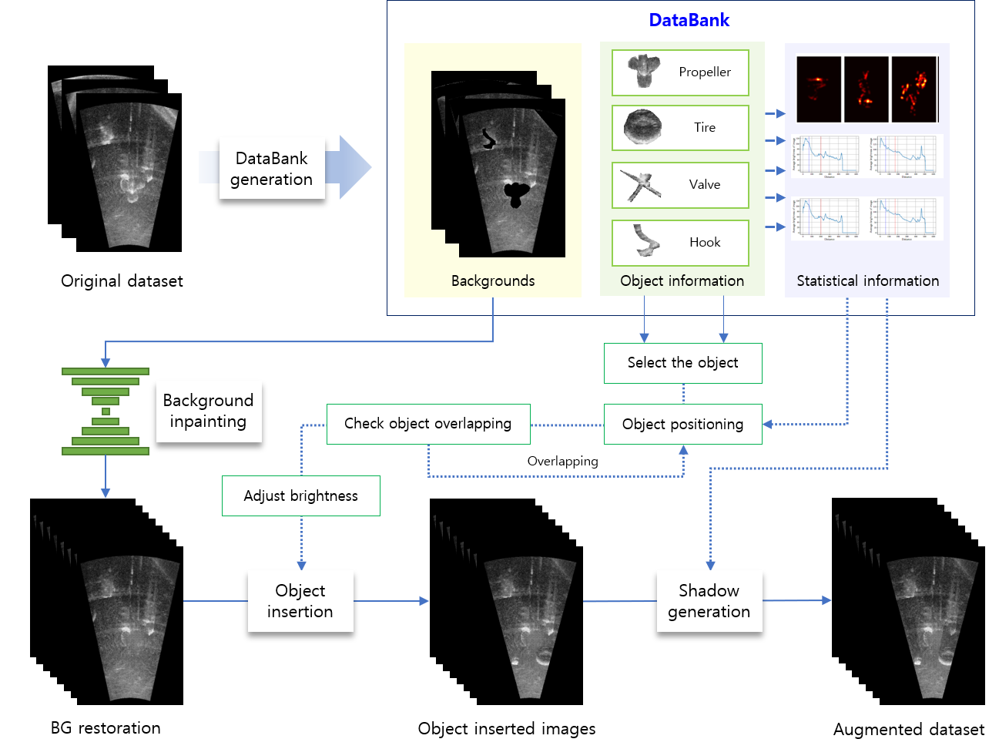

# SACuP: Sonar Image Augmentation with Cut and Paste Based DataBank for Semantic Segmentation
Code for the paper "SACuP: Sonar Image Augmentation with Cut and Paste Based DataBank for Semantic Segmentation"
### Abstract
> In this paper, we introduce Sonar image Augmentation with Cut and Paste based DataBank for semantic segmentation (SACuP), a novel data augmentation framework specifically designed for sonar imagery. Unlike traditional methods that often overlook the distinctive traits of sonar images, SACuP effectively harnesses these unique characteristics, including shadows and noise. SACuP operates on an object-unit level, differentiating it from conventional augmentation methods applied to entire images or object groups. Improving semantic segmentation performance while carefully preserving the unique properties of acoustic images is differentiated from others. Importantly, this augmentation process requires no additional manual work, as it leverages existing images and masks seamlessly. Our extensive evaluations, contrasting SACuP against established augmentation methods, unveil its superior performance, registering an impressive 1.10% gain in mean Intersection of Union (mIoU) over the baseline. Furthermore, our ablation study elucidates the nuanced contributions of individual and combined augmentation methods, such as cut and paste, brightness adjustment, and shadow generation, to model enhancement. We anticipate SACuP’s versatility in augmenting scarce sonar data across a spectrum of tasks, particularly within the domain of semantic segmentation. Its potential extends to bolstering the effectiveness of underwater exploration by providing high-quality sonar data for training machine learning models.
### Pipeline

### Experiments

## Usage
### Setup Workspace
Clone this Git repository.
```bash
git clone https://github.com/AIRLABkhu/SACuP.git
cd SACuP
```
<!--
### Augmentation
```bash

```
### Training
```bash

```
### Testing
```bash

```
-->
